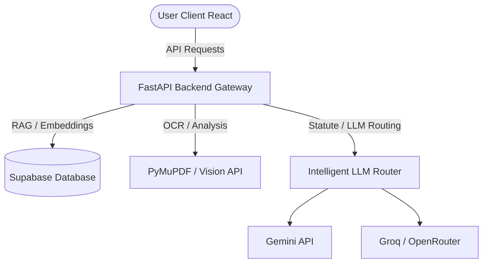

# ⚖️ NyayaSahayak (न्यायसहायक) — Product Guide

> **Tagline:** *"Har Haq, Har Pal, Har Case — AI ke Saath."*
>
> Welcome to the comprehensive guide for **NyayaSahayak (न्यायसहायक)**, a next-generation AI-driven legal companion custom-built for the Indian Legal System. This guide serves as a bridge for two types of users:
> 1. **Naive Users (The Aam Aadmi / Layperson):** Non-legal folks who need simple, jargon-free help.
> 2. **Expert Users (Advocates, Law Students, & Corporate Counsel):** Legal professionals who want to understand the exact mechanics, compliance, and technical underpinnings.

---

## 🧭 Table of Contents
1. [👶 Naive User Guide (Aam Aadmi ke Liye)](#-naive-user-guide-aam-aadmi-ke-liye)
2. [💼 Expert User Guide (For Lawyers & Legal Experts)](#-expert-user-guide-for-lawyers--legal-experts)
3. [⚙️ Under the Hood: Deep Dive into the 4 Features](#-under-the-hood-deep-dive-into-the-4-features)
4. [🛠️ Tech Stack & Run Guide](#%EF%B8%8F-tech-stack--run-guide)

---

## 👶 Naive User Guide (Aam Aadmi ke Liye)

अगर आपको कानूनी बातें (Legal jargon) समझ नहीं आतीं, कोर्ट कचहरी के चक्कर काटने से डर लगता है, या एग्रीमेंट साइन करने से पहले घबराहट होती है, तो **न्यायसहायक** आपका पर्सनल डिजिटल वकील है। यह बहुत ही आसान भाषा (English, Hindi, और हिंग्लिश) में कानून समझाता है।

यहाँ इसके **4 मुख्य फीचर्स** हैं जो आपकी मदद करेंगे:

### 1. 🎤 AI Vakil (आपका डिजिटल वकील)
* **क्या है?** यह एक चैटबॉट है जिससे आप किसी दोस्त की तरह हिंदी, इंग्लिश या हिंग्लिश में बातें कर सकते हैं।
* **यह क्या करता है?** आप इससे पूछ सकते हैं—*"सर, मकान मालिक बिना नोटिस दिए घर खाली करा सकता है क्या?"* या *"नया कानून BNS क्या है?"*
* **खास बात:** इसमें बोलकर सवाल पूछने (Voice input) और सुनने (Voice reply) की सुविधा है, जिससे पढ़ना-लिखना न जानने वाले लोग भी इसका इस्तेमाल कर सकते हैं।

### 2. 📂 CaseVault (केस फाइलों की अलमारी)
* **क्या है?** आपके कोर्ट केस से जुड़े सारे पेपर्स, ऑर्डर्स और फाइलों को सुरक्षित रखने और समझने की जगह।
* **यह क्या करता है?** आप अपने केस के PDF पेपर्स यहाँ अपलोड कर सकते हैं। यह ऐप उन सभी पेपर्स को पढ़कर एक टाइमलाइन बना देगा और आपको बताएगा कि पिछली सुनवाई में जज साहब ने क्या कहा था, और अगली तारीख पर क्या होने वाला है।

### 3. 🛡️ ContractGuard (एग्रीमेंट चेकर)
* **क्या है?** कोई भी कॉन्ट्रैक्ट (जैसे रेंट एग्रीमेंट, जॉब लेटर, या बिजनेस डील) साइन करने से पहले उसे चेक करने का टूल।
* **यह क्या करता है?** कॉन्ट्रैक्ट अपलोड करें। AI उसे पढ़कर तुरंत बता देगा कि इसमें कौन सी बातें आपके लिए **खतरनाक (High Risk)** हैं, कौन सी **सामान्य (Medium Risk)** हैं।
* **मदद:** यह आपको यह भी लिखकर देगा कि आपको बातचीत (Negotiate) करते समय क्या बोलना चाहिए और उस गलत लाइन की जगह कौन सी सही लाइन लिखवानी चाहिए।

### 4. 📝 DocDraft (कागज़ात बनाने वाला)
* **क्या है?** कोर्ट के नोटिस, एफिडेविट या लीगल ड्राफ्ट्स बनाने की मशीन।
* **यह क्या करता है?** इसके दो तरीके हैं:
  1. **आसान फॉर्म:** नाम, पता और किराया भरकर रेंट एग्रीमेंट तैयार करें।
  2. **अपनी कहानी लिखकर:** बस अपनी समस्या लिखें (जैसे—*"दुकानदार डिफेक्टिव फ्रिज वापस नहीं ले रहा"*), और AI आपके लिए एक कानूनी नोटिस (Legal Notice) तैयार कर देगा।

---

## 💼 Expert User Guide (For Lawyers & Legal Experts)

For lawyers, legal associates, and corporate teams, **NyayaSahayak** acts as a high-powered **AI Paralegal / Legal Operations Copilot** that reduces hours of reading and drafting to minutes.

### How NyayaSahayak Enhances Professional Practice:
1. **BNS / IPC Statute Mapping:** 
   The transition from colonial-era criminal laws (IPC, CrPC, IEA) to modern codes (BNS, BNSS, BSA) has created a significant learning curve. NyayaSahayak translates section citations instantly. For instance, if you reference *IPC Section 302* (Murder), the AI automatically maps it to *BNS Section 101*, saving manual cross-referencing.
2. **Accelerated Due Diligence:**
   Instead of manually scanning a 50-page commercial lease, **ContractGuard** isolates indemnification traps, non-compete clauses, and jurisdiction issues within seconds, benchmarking them against the *Indian Contract Act, 1872*.
3. **Structured Case Timelines:**
   By parsing historical order sheets, **CaseVault** extracts structural timelines, identifying pending evidence items, witness statements, and judicial remarks, presenting a cohesive litigation strategy.
4. **Drafting Autonomy:**
   Speeds up initial draft filings. Generate custom affidavits, legal notices, or petitions utilizing situational descriptions, compliant with standard court formatting guidelines in India.

---

## ⚙️ Under the Hood: Deep Dive into the 4 Features

Let's explore how each module works programmatically and logically:



### A. AI Vakil (Bilingual Chat & Statute Mapping Engine)
* **Under the Hood:**
  - Implements a multi-model fallback router. It prioritizes ultra-fast models (like Groq) for standard chat and falls back to advanced models (like Gemini) when reasoning is needed.
  - **Statute Map:** Contains a structured dataset mapping IPC sections to BNS sections. When an IPC section is mentioned, the prompt-engineering layer injects the corresponding BNS code context.
  - **Voice Loop:** The frontend utilizes the browser's native `Web Audio API` to capture voice, and sends the transcription request. For text-to-speech output, it leverages the `Web Speech Synthesis API` dynamically with local Indian accents (e.g., `hi-IN`, `en-IN`).

### B. CaseVault (Retrieval-Augmented Generation / RAG)
* **Under the Hood:**
  - **OCR Pipeline:** When a user uploads a case document (PDF/Scan), the backend uses `PyMuPDF` to extract text. If the PDF contains scanned images, the system routes the page image bytes to `Gemini Vision` to extract text via OCR.
  - **Chunking & Vector Store:** The extracted text is split into chunks of ~1000 characters with overlapping windows. These chunks are embedded into vector vectors and stored inside the **Supabase Vector Store (pgvector)**.
  - **Query Resolver:** When a lawyer chats with the Case Copilot, the query is embedded, a cosine similarity search is run against the case's document chunks, and the most relevant snippets along with pre-seeded Bare Acts (CPC, BNSS, BSA) are injected into the LLM context window to generate highly accurate, cited answers.

### C. ContractGuard (Semantic Clause Auditor)
* **Under the Hood:**
  - **Clause Parsing:** The raw text of the contract is parsed and segmented semantically into logical clauses (e.g., Termination, Limitation of Liability, Dispute Resolution).
  - **Auditing Prompt Template:** The segmented clauses are analyzed by the LLM using a system prompt primed with the *Indian Contract Act, 1872*.
  - **Structured output:** The API enforces a strict JSON Schema returning:
    ```json
    {
      "clause_text": "...",
      "risk_level": "High | Medium | Low",
      "explanation": "Simple Hindi/English explanation of the legal impact...",
      "negotiation_points": "Points to speak to the counterparty...",
      "alternative_clause": "Standard boilerplate safe clause..."
    }
    ```
  - **UI Render:** The frontend maps this JSON, highlighting the text on the left panel, and showing interactive cards on the right panel.

### D. DocDraft (Two-Path Document Compiler)
* **Under the Hood:**
  - **Path 1 (Structured Templates):** The user enters parameters. The system injects these parameters into predefined LaTeX/Markdown legal templates (like Lease Agreements, NDAs).
  - **Path 2 (Situation-Driven):** The user describes a problem. The LLM acts as a legal draftsman. It accesses standard formatting requirements (e.g., 1-inch margins, uppercase captions, structured prayer sections) and compiles a legal draft from scratch.
  - **Output Generation:** The backend compiles the final document into PDF/Docx format using libraries like `fpdf2` and `python-docx`.

---

## 🛠️ Tech Stack & Run Guide

### Technology Stack
* **Frontend:** React 19 SPA, Vite, Tailwind CSS v4, Lucide Icons, Zustand (State Management).
* **Backend:** FastAPI (Python 3.12), Supabase Python SDK, PyMuPDF (OCR), Uvicorn.
* **Database:** Supabase (PostgreSQL with pgvector extension).

### Running the Project Locally
If you want to run this application on your local machine, follow the instructions in the project blueprint:
- For Backend running steps, see the Python setup and run instructions.
- For Frontend running steps, see the NPM setup and run instructions.
- Make sure to clear browser service worker cache (under *DevTools > Application > Service Workers*) if you see a blank page, to avoid caching conflicts from other projects running on local port `5173`.
