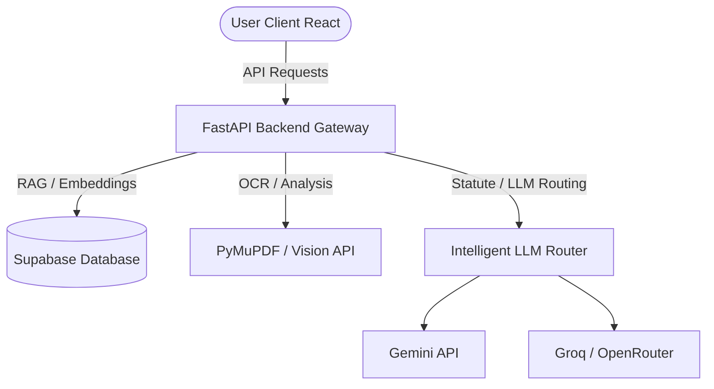

# ⚖️ NyayaSahayak (न्यायसहायक)

> **Tagline:** *"Har Haq, Har Pal, Har Case — AI ke Saath."*  
> **NyayaSahayak (न्यायसहायक)** is a next-generation AI-driven legal companion custom-built for the Indian Legal System. It serves as a digital paralegal and legal operations copilot, bridging the gap between complex legal frameworks (IPC/BNS) and everyday citizens.

---

## 🧭 Table of Contents
1. [👶 Layperson User Guide (Simple Legal Assistance)](#-layperson-user-guide-simple-legal-assistance)
2. [💼 Expert User Guide (For Lawyers & Legal Experts)](#-expert-user-guide-for-lawyers--legal-experts)
3. [⚙️ System Architecture & Under the Hood](#-system-architecture--under-the-hood)
4. [🛠️ Tech Stack & Run Guide](#-tech-stack--run-guide)

---

## 👶 Layperson User Guide (Simple Legal Assistance)

If you find legal terminology confusing, dread dealing with court proceedings, or feel anxious before signing agreements, **NyayaSahayak** is your personal digital lawyer. It translates complex legal concepts into clear, simple language (English, Hindi, and Hinglish).

Here are its **4 main features** designed to assist you:

### 1. 🎤 AI Vakil (Your Digital Lawyer)
* **What is it?** A conversational chatbot that communicates in English, Hindi, or Hinglish just like a professional assistant.
* **What does it do?** You can ask questions such as—*"Can my landlord evict me without notice?"* or *"What is the new BNS criminal law?"*
* **Key Feature:** Supports voice input and text-to-speech output, allowing everyone to easily speak to and hear legal advice.

### 2. 📂 CaseVault (Secure Case Locker)
* **What is it?** A secure digital repository to store and understand all your court case documents, orders, and filings.
* **What does it do?** Upload PDFs of your court filings. The AI parses the documents to generate a structured timeline, explaining judicial statements from past hearings and highlighting next steps.

### 3. 🛡️ ContractGuard (Smart Agreement Checker)
* **What is it?** A tool to analyze contracts (such as lease agreements, job offer letters, or business agreements) before signing.
* **What does it do?** Upload a contract and the AI will flag **High Risk** and **Medium Risk** clauses.
* **Key Feature:** Provides negotiation recommendations, outlining talking points and recommending replacement clauses.

### 4. 📝 DocDraft (Automatic Document Drafter)
* **What is it?** An engine to draft legal notices, affidavits, and standard agreements.
* **What does it do?** Offers two drafting paths:
  1. **Template Forms:** Fill out a quick form (name, address, rent details) to instantly compile a standard agreement.
  2. **Situation-Based:** Describe your dispute (e.g., *"Shopkeeper refusing to return defective product"*), and the AI generates a professional legal notice.

---

## 💼 Expert User Guide (For Lawyers & Legal Experts)

For lawyers, legal associates, and corporate teams, **NyayaSahayak** acts as a high-powered **AI Paralegal / Legal Operations Copilot** that reduces hours of reading and drafting to minutes.

### Key Professional Capabilities:
1. **BNS / IPC Statute Mapping:** 
   The transition from colonial-era criminal laws (IPC, CrPC, IEA) to modern codes (BNS, BNSS, BSA) has created a significant learning curve. NyayaSahayak translates section citations instantly. For instance, if you reference *IPC Section 302* (Murder), the AI automatically maps it to *BNS Section 101*, saving manual cross-referencing.
2. **Accelerated Due Diligence:**
   Instead of manually scanning a 50-page commercial lease, **ContractGuard** isolates indemnification traps, non-compete clauses, and jurisdiction issues within seconds, benchmarking them against the *Indian Contract Act, 1872*.
3. **Structured Case Timelines:**
   By parsing historical order sheets, **CaseVault** extracts structural timelines, identifying pending evidence items, witness statements, and judicial remarks, presenting a cohesive litigation strategy.
4. **Drafting Autonomy:**
   Speeds up initial draft filings. Generate custom affidavits, legal notices, or petitions utilizing situational descriptions, compliant with standard court formatting guidelines in India.

---

## ⚙️ System Architecture & Under the Hood



### Feature Deep-Dives:
* **AI Vakil (Bilingual Chat & Statute Mapping Engine):** Implements a multi-model fallback router prioritizing ultra-fast models (like Groq) for standard chat, falling back to advanced models (like Gemini) when reasoning is needed. Uses Web Audio and Web Speech Synthesis APIs for voice loops.
* **CaseVault (Retrieval-Augmented Generation / RAG):** Backend uses `PyMuPDF` and `Gemini Vision` to perform OCR on PDFs and scans. Text is split into overlapping chunks, embedded, and stored in **Supabase pgvector**. cosine similarity search is run during Copilot chats to pull relevant citations.
* **ContractGuard (Semantic Clause Auditor):** Parses and segments contract clauses. Evaluates compliance against the *Indian Contract Act, 1872*, returning structured JSON audits specifying risk levels, negotiation points, and alternative boilerplate text.
* **DocDraft (Two-Path Document Compiler):** Integrates parameter-driven template generation and situation-driven custom drafting. Generates PDF/Docx output using libraries like `fpdf2` and `python-docx`.

---

## 🛠️ Tech Stack & Run Guide

### Technology Stack
* **Frontend:** React 19 SPA, Vite, Tailwind CSS v4, Zustand (State Management).
* **Backend:** FastAPI (Python 3.12), Supabase Python SDK, PyMuPDF (OCR), Uvicorn.
* **Database:** Supabase (PostgreSQL with pgvector extension).

### Running the Project Locally

#### 1. Backend Setup
```bash
cd backend
python -m venv venv
venv\Scripts\activate
pip install -r requirements.txt
uvicorn app.main:app --reload
```

#### 2. Frontend Setup
```bash
cd frontend
npm install
npm run dev
```

---
*Created by [Prabhjot Singh](https://github.com/prabhjotSingh-002)*
